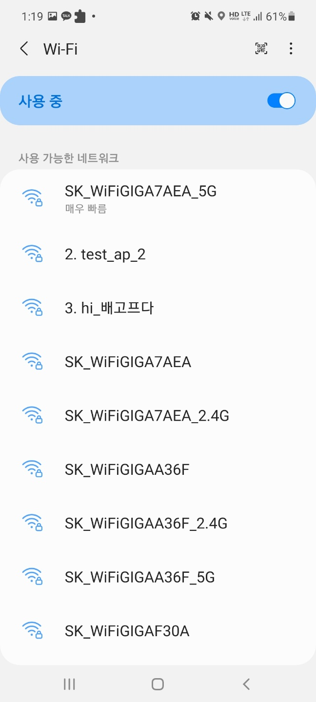

# Beacon-Flood

## Beacon-Flood?

무선랜(AP)이 자신을 station에게 알리는 패킷인 Beacon 패킷에서 AP의 보이는 이름에 해당하는 ESSID 값을 조작하여 계속 보냄으로써 실존하지 않는 AP를 다른 station에게 있는 것 처럼 속일 수 있다.

또한 만약 BSSID 값을 다른 진짜 AP와 같게 설정하여 Beacon-Flood를 진행한다면 공격자가 더 가까이 있는 경우 타겟 Station에서 AP를 검색할 때 공격자의 가짜 AP가 진짜 AP 대신 뜨도록 속일 수도 있다.

## 사용법

```bash
syntax: $ beacon_flood <interface> <ssid-list-file>
sample: $ beacon_flood mon0 ssid-list.txt
```

- **!주의! : ssid-list.txt의 맨 마지막에는 개행을 남기지 말 것!**

## 결과

- `2. test_ap`(영어)와 `3. hi_배고프다`(한글)가 beacon-flood attack에 의해 보이는 것을 알 수 있다.  



## 참고

- [이경문 멘토님 과제]([report beacon flood · Wiki · gilgil / sns · GitLab](https://gitlab.com/gilgil/sns/-/wikis/dot11-frame/report-beacon-flood))
- [이경문 멘토님 블로그]([Beacon Flooding Attack | gilgil](https://gilgil.gitlab.io/2020/09/07/2.html))
- [내 airodump 코드](https://github.com/OZ1NG/airodump)
  - 이곳의 구조체는 참고하지 말 것(enum만...)
- [내 deauth-attack 코드](https://github.com/OZ1NG/deauth-attack)

## 여담

libtins 라이브러리가 다운받아지지 않아 libtins를 사용하지 않고 내가 이전에 만들었던 구조체를 변형하여 만들었는데 생각보다 잘되었다. 다만 내가 커스텀한 패킷 데이터라 구조가 평범한 beacon packet과 달라서 그런건지 와이어샤크에서  [FCS(Frame Check Sequence)](http://www.ktword.co.kr/test/view/view.php?m_temp1=873&id=744)가 제대로 인식이 되지 않는 것으로 나오고 모바일 기기(겔노트20)에서는 잘 잡혔지만 노트북에서는 잡히지 않았다는 점이 조금 아쉽다.
